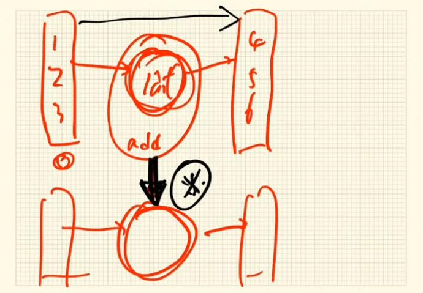

## 函数式编程分析之初探

定义一个函数，通过一个简单的函数，带大家思考一些编程思想。

```javascript
var express = require('express');
var app = express ();

function add(x,y) {
  return x + y;
}

var value = add (1,2);

console.log(value);

module.exports = app;
```

```
//express webapp 环境

> node ./bin/www
=> 3
```

  
做一点变化：把函数定义到lib.js里，引出去。  
```javascript
// 新建 lib.js 

// 定义函数
function add(x,y) {
  return x + y;
}
// 导出
module.exports = add; 
```
----
备注：最新方式
```javascript
export default function (x, y) {
  return x + y;
}
```
----
```javascript
// app.js

var express = require ('express');
var app = express();
var add = require(./lib); // 引包

var value = add(1,2);     // 传值

module.export = app;

```

在lib里定义了函数add，传了两个值x,y,返回一个值`x + y`;  
在app里通过`引包`的方式执行代码。  
在 lib 导出去，这个 add 是什么函数？换一个地方，把它定义在 lib 里，在老师的代码里是不是引入这个 lib 包，是不是就能调用 add 函数。   
add 像一个工具函数。它会做加法。  
传任何两个值进去，它就能做加法。  
是不是我们的代码里就应该是这样子的？

```javascript
// app.js

var express = require('express');
var app = express();
var add = require('./lib');

add(2,3);
add(4,7);

module.exports = app;

```

代码里边就应该有很多工具函数。  
在真正做事的时候，只需要调这些函数来做事，  
是不是就可以了？（对这个的认知应该没问题）对。换句话讲，你的工具之所以能成为工具，是说工具有大有小，你的工具相对比较单一，工具的能力就小;(功能多或工具多，)工具的能力就大一点。  

如果想做一件事，想要让一个数加1，比如传一个6进去。
希望加1，自增加1。那么用 add 函数就是 add(6,1);如果传9，也要加1，`add(9,1)`。
```javascript
add(6, 1);
add(9, 1);
add(10, 1);
```
这个函数只是希望传进去一个值加1，但是要调 add 就很迁强。为了解决这个很迁强的问题，再定义一个函数叫 inc。

```javascript
// lib.js
function add(x, y) {
  return x + y;
}

function inc(x) {
  return x + 1;
}

module.exports = { add, inc }; //导出一个object
```

传进一个值就（执行） x + 1,返回;
这就要返两函数 add , inc 出 lib.js 了。  
并在 app.js 做一些改动， ` var add `改成 ` var lib `。

```javascript
var express = require('express');
var app = express ();
var lib = require('./lib');   // add 改成 lib

lib.add(3, 4);    // 非+1的计算
lib.inc(6);
lib.inc(9);
lib.inc(10);

module.exports = app;
```

现在导出的是一个 object ：`{ add, inc }` 。  
之前导出的是一个函数，现在导出两个函数。
所以要改成（引入）lib。

看上去很完美。  
`lib.add(3, 4)` 可以做非+1的计算。  
各司其职。  

---------------------------------------

@lib.js 
这不就是个加法吗? 在数学运算里边，它不就是个加法吗？为什么要搞出两个函数？我管你+1。针对我们返回的值，不就是个加法吗？你不能因为这边加的是固定1，就搞出一个函数，然后这边加的是动态值，又搞出一个函数。举个简单的例子，后来又有需求了，自增长2。是不是又要无限拓展？（导出inc2)  
虽说代码是人写的，但是不是这么个道理。  
需求总是很多。我们总是在追求一些方式方法去解决这样一些问题。  
不管是`lib.add(3, 4)`，或是这里`lib.inc(6)`,都是做两个函数的相加。就是这么简单。  

```javascript
// lib.js
function add(x, y) {
  return x + y;
}

function inc(x) {
  return x + 1;
}

function inc2(x) {     // 增加自增2的函数
  return x + 2;
}

module.exports = { add, inc, inc2 }; //再导出一个 inc2
```
```javascript
// app.js
var express = require('express');
var app = express();
var lib = require('./lib');   

lib.add(3, 4);       // 两数相加
lib.inc(6);          // 两数相加
lib.inc(9);
lib.inc(10);

module.exports = app;
```


--------------------------------------------
做一些变动。 


```javascript
// lib.js
function add(x) {
  return function(y) {
    return x + y;
  }
}

module.exports = add; // 导出 add
```


定义一个函数，只传进一个 x ; 再返回一个函数，这个函数又会接收一个参数 y ; 再对 x 加 y 。进行这样的相加、返回。 回去 app.js，拿了一个（引入）add 。

也就是说，  
函数 add 传入 x , 返回一个函数; 这个函数又接收一个参数。 （如上 lib.js）
写代码时会 add(1)(2) ; 得出的值就是 1 + 2。（如下 app.js ） 


```javascript
// app.js
var express = require('express');
var app = express();
var add = require('./lib');   // 引入 add

add(1)(2);     // 改变

module.exports = app;
```

因为 `add(x)` 返回一个function:

```javascript
function(y) {
  return x + y;
}
```
换句话来讲，add(1)是个函数。函数的执行，就是加（）号，即 add(1)(); 
再传 2 进去是add(1)(1) ;  
这个函数解决了所有问题。  
那么，怎么用这个函数来实现需求？

```javascript
// app.js
add(3)(4);  // 两个参数相加
add(1)(3);  // 自增1
add(1)(4);  // 自增1
```
-----
把这件事情变得更牛逼一点。这时候思想就来了。  
定义一个函数。


```javascript
// app.js
var express = require('express');
var app = express();
var add = require('./lib');   

add(1)(2);     

var inc = add(1);      // 定义一个函数    

inc(2);                // 增加

inc(3);
inc(4);

module.exports = app;
```


就这两个简简单单的代码，带来的思想就完完全全不一样。
inc 调了一个 add ，传了一个 1 ，得到一个函数。以后我得到一个 inc 就知道了，就可以搞定了（+1）。  
也就是说，根本不 care inc函数内部到底是什么东西。我只知道 inc 自动会 +1。这就是思想。  

---------------------------------------
再做点变化：

```javascript
// lib.js
function add(x) {
  return function(y) {
    return x + y;
  }
}

var inc = add(1);      // 在 lib 定义

module.exports = { add, inc }; // 导出 对象，导出 inc
```
导出 inc 后，只需要【调用lib.inc()】。
```javascript
// app.js
var express = require('express');
var app = express();
var lib = require('./lib');    // 引入 lib 

lib.inc(2);                    // 【方法调用；把文件里的函数，当作对象里的属性】
lib.inc(3);
lib.inc(4);

module.exports = app;
```


这不还是定义了两个吗？是的。这样做老师以为不好。  
原因在于说这种自增长的数是业务需求的。我有了根函数，兜底的根函数 `add`。  
也就是说，  
有了根函数之后，可以拓展出很多个抽象型的函数。  
可以拓展成add，那么 inc 就成了自增为 1 的。  
【老师的意思应该是: 用下面方式会更好。直接用根函数。】  
  

```javascript
// app.js
var add = require('./lib');    // 引入 add 

var inc = add(1);   // +1
var inc = add(2);   // +2
add(3)(4);

module.exports = app;
```
定义一个 inc2， +2。  
那在业务里就可以不断地使用这两个函数。  
两个数的相加，也可以。要拓展自增为1，自增为2、3、4。这件事没有任何问题。  
这就是函数式编程。  

---
反过来，思考一下，这些函数，不care它们是怎么执行的。  
函数式编程就是说它封装了过程，不care函数是怎么执行。  
我只知道我要干嘛。传一个参数进去之后，  
就可以得到一个新的函数;这个新的函数具备的能力就是我想干嘛。加法就是这样（做）。  
看下传统型的编程。  

```javascript
var x = 2;
var y = 2;

var z = x + y;

function add(x, y) {
  return x + y;
}
```

做得最好，无外乎是封装了一个函数。有的人到此就满足了。  
但只能做【现有值的】加法。想【像下面这样】拓展就做不到了。  
```javascript
add(3)(4);
add(1)(3);
```

### Ramda
ramda的牛逼之处就是说它把`实现的过程`全部做成了函数。  
刚刚老师带着大家实现了 R.add 的做法（用 lib.js 里 add 的函数）。调了一个 R.add(7)(10),得到17。  
```javascript
Number → Number → Number

R.add(2, 3);       //=>  5
R.add(7)(10);      //=> 17

```


` 
笔记做到这些，终于明白，为什么ramda的函数签名的箭头全是一样，包括最后的返回。
就是老师后面讲的，ramda的柯里化，传入一个参数返回一个函数，再传入一个参数再返回一个* 函数，最后得到一个值。参数的传入，到最后返回的值，都是一个接一个，所以用同一种箭头表* 示这样的顺畅是很贴切的。
`

只是为了一种兼容性的写法，写成单括号、双括号都行。只是为了写得更拓展。拿到 R.add 也能实现前面讲的技巧。
```javascript
var inc = R.add(1);
inc(3); =>4
```
也就是说，  
通过函数，创造函数。通过一个公式，得到一个新的公式。  
有一个集合，还有另一个集合。中间通过一个公式， 1、2、3 会映射出4、5、6。  
左边的值通过数学公式，一定能映射出一个唯一的结果。左边的值和结果，要一一对应。  
如果把公式进行拓展，再生成，再组装。通过结合，各种定律，得到一个新的公式，一样可以。  
就是这样的一个理念。  

函数式为什么要这么做？为什么要去映射？不只是映射出结果，（今天的例子）还从公式映射出公式，这实际上又是函数式编程一个非常大的学问。  
怎么去做得到的？这还是一个重点。为什么要这样做？其实有时候，`编程的目标`是让开发者得到一个结果，就是“`定义过程`”。`“定义过程的目标`又是什么呢？让开发者在做一件事情的时候，`尽量少地感知整个过程的存在`。  
`只是想把一个值传进去，得到一个结果。`  
只是想要拿3加1，别让我自己去加1。 能不能有一个函数，我把3给你，你就加上1，就完事了。编程以后就写得很简单。如果未来在处理这些事情都是这样的一个模式的话，编程不就很简单了。  
`你做的一个事情，都有一个对应的函数帮你实现结果。 ` 
但我们不能穷举所有函数。世上万物是穷举不出来的。  
穷举不出没关系。假如用一个函数能生成另一个函数，具备这种能力，也可以呀。  
万物穷举不出来，但是假如能够通过一个东西得到另一个东西，那得到这个东西，就可以去创造另一个东西。  
通过 add 函数得到 inc 函数，就能享受 inc 带给我们的好处。编程就是这样好玩。  
我得到一个函数；这个函数又得到创造能力。  
假如生物链条一直这样下去，拿到 inc 还可以创造。  
如果再拿 inc 去创造，你还要具备一些能力。  
函数式编程就是很有魅力。就在于这，  
`它屏敝了所有过程。`  
一个小小的 add 函数，带来的是`代码设计`的哲学思想。（这个思想）其实是很深的。不要小看这个简简单单的`闭包函数`。5行代码。别小看。
好好领悟内部的东西。  
```javascript
function(x) {
  return function(y) {
    return x + y;
  }
}
```
R.add 就是一个函数。不仅可以接收两个函数，也可以只接收一个函数，这属于柯里化。  

### 柯里化  
【第一次讲】  
柯里化的目的是为了让所有代码都能写得...（柯里）他认为函数如果能只接收一个参数就够了。不要接收2、3、4个。如果你要2、3、4个，我也可以给你改成...帮你通过柯里化的方式去解决。  
```javascript
//正常使用方式
R.add(1, 2)

// 也可以 
// 柯里化
R.add(1)(2)
``` 

也就是，一个函数 R.add() 只接收一个参数，接收1时，生成一个新的函数 R.add(1) ,然后这个新函数再给它一个函数（应该是：参数）的时候R.add(1)(2)，它就能相加。  
`函数式编程`有一个`很重要的基点`，就是希望整个`函数设计`得应该都是`柯里化`的。      
  
  
（以下例子）不是实现了一个柯里化函数吗？  
```javascript
// lib.js

function(x) {
  return function(y) {
    return x + y;
  }
}
```

之前定义的是一个普通的 add 函数： 
```javascript
// 传统普通写法
function (x, y) {
  return x + y;
}
```
现在定义了一个 add 的柯里化函数。
 
-------------
万能五笔里竟然能连打出 柯里化。太惊奇了 ！