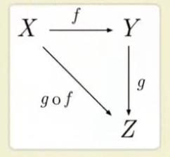

## 函数式编程分析之正传
 almost 逐字文本

## 柯里化

```javascript
function add(x,y) {
  return x + y ;  
}

add(1, 2);
```

curry化的概念很简单：  
只传递给函数一部分参数来调用它，让它`返回一个函数`去`处理剩余的参数`。

```javascript
function add(x) {
  return function(y) {     //返回一个函数，处理剩余函数
    return x + y ;
  }
}

add(1)(2);
```

## 函数合成（compose）

( x通过 f ,得到 y 值 )  

```javascript
function addOne(x) {
  return x + 1;
}

function addTwo(x) {
  return x + 2;
}

function add(f,g) {
  return function (x) {
    return f(g(x));       // 被 g(x) 先处理了一下; g 是 addTwo
  }
}

add(addOne, addTwo)(1); // 4
```
add(addOne, addTwo)输出了一个函数。  

如果把这些函数都屏敝掉，通过一个库的方式引进来：
```javascript
// 【只看到调用表达式】
 add(addOne, addTwo)(1);
```
这样调用函数很奇怪？都不用调到参数的？也就是说，调用了一个add函数，传了两个函数给它再给了个 1 ，然后两个函数都不带参数的，也就是什么都没给它，它就执行了。  
就像`app.use('/',index);`怎么什么都没给它，它就有参数了？怎么传给它的？  
把 add 的实现屏敝掉，不就是 `add(addOne, addTwo)` 这样吗？  
调用 add ，接着 addOne , addTwo 整个过程就实现了。我没有传任何参数。  
但是把细节展出来后，你会发现一个道理：也就是说，
实际上`预定了过程`，这就真正诠释了一句话，  
`函数式编程定义过程`。    
我们定义的是整个过程。

------

```javascript
function (x) {
  return f(g(x));
}
```
`add` 什么都没做，只是帮你返回了一个 function 。整个 function 里面，把整个过程预制好了。 `add(addOne,addTwo)` 简单一句话,已经建立了整套代码执行的流程。有了这样一套流程，你再给它一个参数，它自己知道怎么去做这件事。  
换算到`app.use('/',index)`也是一样的，JS 代码、函数式编程的代码，不需要`显式地塞参数`进去。因为只要大家都遵循一种函数式编程的（方式）。  
因为大家都知道函数式编程就是定义过程。你先得到一个过程，那么传参这件事其实就是 `app.use` 里面帮你干的这件事情。  
```javascript
function addOne(x) {
  return x + 1;
}

function addTwo(x) {
  return x + 2;
}

add(addOne, addTwo)(1);

/*
* 把 add 抛掉（隐藏）：
* function add(f, g) {
*   return f(g(x));  
* }
```
我们很明白 addOne,addTwo，即使是你定义的函数，你（还是）需要一个 x 。但是在调用过程中，没有显式地给它一个参数，但 add 这个函数 `add(addOne, addTwo) 它很明白知道怎么把它接收到的 (1) 参数给到 addOne 、addTwo ,然后把整个过程计算。`这就是`函数式编程思想`。这就叫作`定义过程`。（20:36）  
【`用函数的执行把过程像流程一样固定下来`，传参，流程会自动执行，（中间包括自动判断往哪个分支走）。】  
  
拿到这个值，就像个流水线，整个流水线铺好了，剩下的只需要给它一个参数，这就解释了，在 JS 代码里总是有这么多奇怪的代码。【 app.use 这类调用表达式】Java , Ruby 都是显式地传参。  
假如函数都是 addOne(1) 这么调的，这个世界就很美好了嘛。  
注： "addOne(1)"应该只是指代 "add(addOne, addTwo)(1)" 的形式。可以从以下反例推导。
-----

【反例】  
```javascript
function addOne(x) {
  return x + 1;
}

function addTwo(x) {
  return x + 2;
}

// 以下不一样
var value = addOne(1);    
addTwo(value);           
```
如果这么写，这个代码就是一次性买卖，没有办法复用，还要照顾到整个过程。因为需要知道 addOne 是+1的，addTwo 是+2的，拿到值后再手动地填来填去。很容易出错。  
假如能`在进行计算之前，先把过程定义好`:
```javascript
function add(f,g) {
  return function (x) {
    return f(g(x));       
  }
}
```
这就是定义过程。有了这个过程，先 g(f(x)) 或 f(g(x))在某种意义上，没有任何问题。因为都是加法。先`+1`或先`+2`，都没有问题。加法的交换律本身没有问题。计算复杂了之后，这么交换可能出问题。  

-----

那么，问题来了，到底应先执行 g 还是 f ? 有没有一种原则？ 在这里是用 f(g(x))。  
(学过编程的同学回忆下，)  
```javascript
if(x === y || x !== 3 || x === 4)
```
这里先执行哪个?先执行左边。  
在最早的C语言，先执行是的最右边。形成了一个传统。  
在写函数式编程的时候，从某种意义上也是一样。
如果我们要写一个这样的函数，可以从 g 开始，从 (f,g) 的右边开始。
```javascript
// 包括 addOne 和 addTwo
...
function add(f,g) {
  return function (x) {
    return f(g(x));       
  }
}
```


但是，中间件，上次说可以按（从左到右）顺序写，那岂不是先执行后面再执行前面？  
```javascript
app.use(logger('dev'),bodyParser.json(),bodyParser.unlencoded({ extended: false}));
```
但这不一样。只是用这种方式解释一种函数编程的方式。  
虽然app.use也是一种函数式编程的方式。app.use的基理跟设计这个 add 函数的基理不一样。  
所以在例子里，先f(g(x))是ok的，是公认的。因为它本身是一个`独立的个体`。  

```javascript
function add(f,g) {
  return function (x) {
    return f(g(x));       
  }
}
```

如果抛掉（以上）代码的详细执行，也许add是从别的地方引过来的，比如 `var add = require('add')`，看到 `add(addOne,addTwo)` ，传给它两个函数，这种就不要有陌生感。觉得怎么没有参数。 add 内部一定会帮你把参数传给（里面两个函数）。不要觉得怎么没用参数？ add 内部一定会帮你把参数传给（ addOne 、addTwo ）它们。 如果代码能写得这么简单，整个过程就很舒服。  

另，app.use 里的参数要看 doc 文档写参数。【Q:还不明白】

-----
【20：45】
### 加法器拓展
上节课的拓展  

上节课，李想总结了。我在看的时候发现，上节课讲的加法器，实现了一个特别好玩的东西。这个加法器不仅解决了数学相加的问题，甚至竟然可以通过进行两个字符串的拼接。因为我们知道在 JS 里面，两个字符的相加是可以拼成一个新的字符串的。可以用这个加法器，做成一个 HELLO 函数。你只要 hello , 给它传一个'美女'字符进去后，它自动在前面加一个 hello 。  
这件事情就很好玩。所以我希望同学们就是说，把这个加法器，以及今天老师跟你们演示的`函数组合的方式`,加以练习一下。  
因为为什么？这两种东西是函数式编程里边最基本的使用方式。  
然后阮一峰那篇文章他也有写得很详细，你们稍加看一下。然后最后三节课，我们就正式进入 promise 这样的知识点里边。 

摘自 老师补充的代码：
#### 上面的加法器 add 不仅可以运算数字，也可以运算字符。
```javascript
add('hello')('world'); // helloworld
```
#### 通过加法器设计一个 hello 函数
```javascript
var hello = add('hello');
```

#### 运用 hello 函数可以对传进来的名字打招呼
```javascript
hello(' 美女'); // hello 美女
```

#### 假如有一个用户的数组
```
var users = [{name:'lixiang',sex:"girl"},{name:'yufei',sex:'boy'}];
```

#### 设计两个自动加称呼函数
```javascript
var miss = add('Ms. ');
var mr = add('Mr. ');
```

【20：47】
### 预加载的概念
在某种情况下，
这种调一个函数
给它两个函数参数，得出一个新函数，这样一个概念，我们某种情况下，还种新的说法，我希望同学们以后
看到什么书在用到这种说法的时候，不要产生陌生感。定义过程还有一种说法叫预加载。
定义过程 === 预加载   
换句话来说，我先给它一点参数，然后我先给它一个新函数，那么，你得到的这种新函数，它就有点像是，我先给它一个参数，先加载出一个函数。  
定义过程其实就是一种预加载的过程。

在编程里面，特别是函数式，我们今天这两个点，如果你能把它理解透，你能把它运用得恰当，你对于再去学习 express ，看p到很多代码的时候，你有很多问题都迎刃而解。那么，函数式编程其实有种感觉，它
对待一种新鲜事物，你会发现，没有它，我的日子也是一样过的。但是一旦拥有新鲜事物，会离不开。  
学习函数式编程就是这样的，特别是在 JS 里面，特别好玩，你不用，没问题，代码照样写，程序照样执行，WepApp 照样搞定，但是你一旦用上了，你就会发现我离不开。这个好玩度就在这。所以说，它成了一个无足轻重，最后你又不可缺少。我希望你们谁再去总结一下关于函数式组合的方式。这个方式很重要，理解函数的定义，品味这个函数定义的过程。  

函数式编程有两个特点：
如果没有讲就没办法解释怎么对待 app.use 。 
1. 纯洁、透明：非常重要的特点
2. 
函数式编程有一个非常好的特点，任何一个函数相对来讲，都是一个非常纯洁、透明的。从技术角度来讲，它本身就是一个非常透明的。什么叫透明？是因为函数式什么的情况，才可能称之为“纯洁、透明”？功能很纯粹。功能纯不纯粹，你传进来是什么，出去的就是什么，功能是很单一的，不受外界影响的。

看 app.js 里面，app.use这些，任何一个中间件，不管怎么组合，
(比如，)把它放在前面，从某种程度上来说，也没什么问题;我不要后面的，也没什么问题，也就是说我们相互之间不影响，它们之间就很纯。那么，我们的函数都能设计成这个样子的话，那我个人以为，这就是函数式编程。
```javascript
app.use(bodyParser.unclencoded({ extended: false }));
```

函数式编程，你设计了一个函数，不能受外界的影响。你给一个 x 值进去，它给你的就是一个 y 值。不能说过两天你给它一个 x 值，它出来就是一个什么其它的值。好好品味啊。  
它不能因为外界的参数影响内部。如果哪天你的函数受了外面的影响，你就告诉自己，这不是函数式编程。只是一个普通的编程手法。  
再举个例子：  (之前举过的例子)
```javascript
// 原例
var num = 3;

function(x) {
  ......
  return x + num;
}

addOne(1); // 4

num = 5;

addOne(1); // 6
```
addOne(1) 传个 1 进去，等于4，没问题。  
但是我调用了之后，又改变了（num）值，然后再传 1 进去，等于 6 。
它会受外界的影响，而（改变）它的值。  
那么，这个 addOne ，在函数式编程里面就是一个垃圾函数。它是不可移植的。  
把这个函数引申一下。区区几行代码，可以引申出这种编程的理念或方式方法。  
举个很简单的例子来讲，  
假如把 addOne 移植，假如它里面还有很多很复杂的实现。我觉得我这个 addOne 写得非常牛逼，我要把它拷到别的项目里面去用。  
那不是把这个函数拷贝走吗？（拷贝到别的文件里）  
你会发现这个函数根本跑不起来。它用到了（原来）那个文件里的 num ,你不得不把 num 拷贝进来。  
那么这件事情其实很好玩。我明明要的是一个函数，但是，我把这个函数所附带的一些影响这个函数的很多一些东西都给 copy 进来了。那我就问，有过编程经验的同学，你在抄代码的时候是不是有这种感觉？  
我明明就要一个 class,但是我不得已，还要把 class 里这些继承的，它继承哪的，跟它上下文有关系的一些全都 copy 过来。要一个小点，但是因为这个小点，我移植了大量的对我来说没有太大用的东西。  
那你去体会一下，如果每个函数都是相互独立，都是非常非常独立的，  
（比如，）把函数改成  
把`var num = 3;`放进去，addOne 就成了一个绝对独立的函数。因为（第二个） num 改的不是内部的 num ，而是全局的 num 。这时候（第二个）addOne(1) 输出的就是 4 。
```javascript
// 修改后
function(x) {
  var num = 3;
  ......
  return x + num;
}

addOne(1); // 4

num = 5;   //全局

addOne(1); // 4
```  

这时候，把函数再 copy 一下，体会一下，不受任何的影响。  
函数式编程的魅力就在这。  
你如何判断自己（所写的是函数式的？）  
刚刚（原例）的不叫做函数式编程，(修改后)就变成函数式编程。  
为什么？因为我把它外在的影响的东西变成了一个相对独立的。  
一下子就从非函数式编程，变成了函数式编程。  
因为它满足了函数式编程的一个特点，就是，函数是透明的，是可以移植的，是非常不受外界影响。  
这就是一个编程的看起来简单，但是如果在实际过程中，能把这件事情做好以后...为什么说函数式编程解决了很多面向对象编程，以及过程编程的一些烦恼。  
这是面向对象编程不可逾越的一件麻烦事儿。  
所以说编程，特别有的同学也在学习 Java ，我觉得这样一个技巧，有助于你把 Java 代码写得更牛逼，而不是总在那里考虑怎么去抽象，怎么设计对象、 class 。  

【21：00】
（后面讲了 md5 密等等）